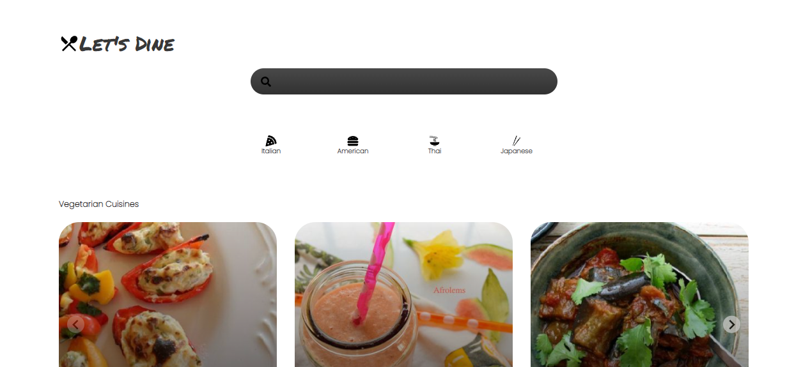
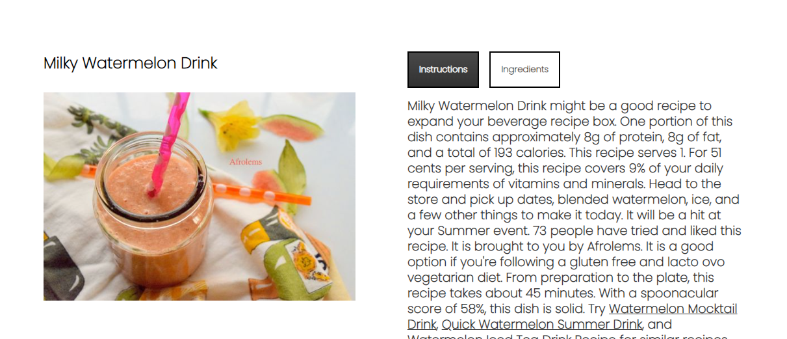

# About
The food-recipes desktop app is a best place for you to search for different recipes and try it at home. You can either search in the four categories provided [*Italian*, *American*, *Thai* and *Japanese*] or you can search for as per your wish. 

### How the Application is setup?

1. #### The Application has the four default components at the top of the page ( HomeScreen Logo, Search Bar and Category selection section) below the screen will be rendered as per the request made by the user. 

> Default Screen will be the Home Screen which lists **Vegetarian** and **Popular** *Cuisines*. You can scroll and view different cuisines here. 

2. #### If you click on any recipe you will be taken to the recipe details page where you are provided with the **Instruction** and **Ingredients** for the recipe you have searched. 

### TechStacks used to build this Application

1. React JS
2. Firebase
3. Spoonacular API

Feel Free to drop me some interesting ideas you wish to add to this project to make it more appealing[^1].
